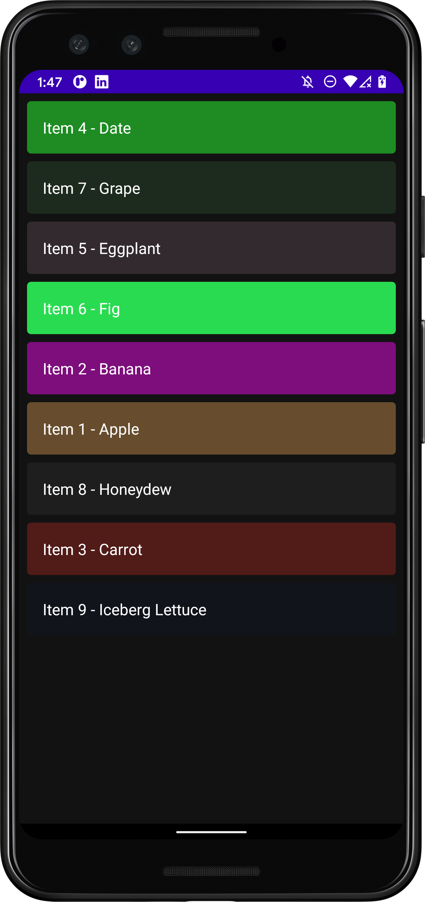

# DragDropColumnCompose
Demo android app showing one way to implement drag-n-drop for a LazyColumn.
This same code will also work in KMP (Kotlin Multi-Platform) for iOS and Android.

https://github.com/realityexpander/DragDropColumnCompose/assets/5157474/bbd0a44d-414d-44b2-a55e-eb3260149d40

- Join the KMP Developers Group:
    - Twitter/X: https://twitter.com/i/communities/173988388565860
    - LinkedIn: https://www.linkedin.com/groups/14367209
    - FaceBook: https://www.facebook.com/groups/913147236893976

Reference for code from Stack Overflow from Jurij Pitulja:
https://stackoverflow.com/questions/64913067/reorder-lazycolumn-items-with-drag-drop

## Updated to use Compose Only in February 2024
Updated to work with Kotlin Multi-Platform (KMP) and Compose by removing the Android specific code 
and replacing it with Compose specific code.
